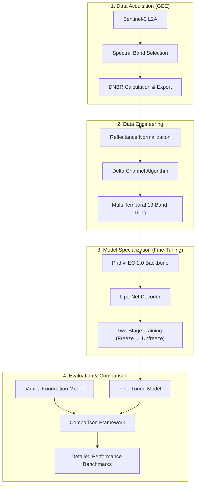

# Prithvi EO 2.0 Burn Scar Project: Technical Deep Dive

This report provides an in-depth technical analysis of the burn scar detection and severity classification pipeline developed using the **Prithvi EO 2.0** geospatial foundation model. This specialized implementation was authored by **Tushar Thokdar**.

## 1. System Architecture

The core of the system is built upon a foundation model approach, fine-tuned for high-resolution change detection in wildfire monitoring.

### 1.1 Foundation Model Backbone

- **Model**: Prithvi EO 2.0 (Tiny version).
- **Type**: ViT-based (Vision Transformer) masked autoencoder specialized for Earth observation data.
- **Pre-training**: Trained by IBM and NASA on massive global satellite imagery datasets (internalizing spatial and spectral temporal patterns).

### 1.2 Segmentation Head (Decoder)

- **Decoder Type**: **UperNet (Unified Perceptual Parsing Network)**.
- **Rationale**: UperNet is highly effective for semantic segmentation as it parses diverse visual concepts (scene, objects, textures) across multiple scales, which is critical for identifying amorphous burn scars.

### 1.3 Input Configuration

- **Dimensions**: `(Batch, Time=3, Channels=6, Height=224, Width=224)`.
- **Spectral Bands**:
  1. Blue
  2. Green
  3. Red
  4. NIR (Near-Infrared)
  5. SWIR1 (Short-Wave Infrared 1)
  6. SWIR2 (Short-Wave Infrared 2)

---

## 2. Tushar Thokdar's Algorithmic Contributions

### 2.1 The "Delta Channel" Strategy

Unlike standard change detection which only feeds pre and post images, this implementation utilizes a **Temporal Stacking with Delta** approach.

- **Algorithm**: `Delta = Clip(Post-fire - Pre-fire, -1.0, 1.0)`.
- **Implementation**: The model is configured to accept **3 frames** (Pre, Post, and the explicit Delta difference).
- **Benefit**: Explicitly providing the difference channel helps the Transformer backbone focus on the _magnitude of change_ rather than just the state of the land, significantly improving classification accuracy for subtle severity levels.

### 2.2 Advanced Fine-Tuning Pipeline

Tushar implemented a sophisticated multi-stage training strategy to prevent "Catastrophic Forgetting" of pre-trained spatial features.

#### Stage A: Backbone Freezing (Epochs 0-5)

- **Mechanism**: The encoder (Prithvi backbone) is frozen.
- **Goal**: Allow the randomly initialized UperNet decoder to align its weights with the pre-trained feature space before modifying the foundation model's "brain."

#### Stage B: Joint Optimization (Epochs 6+)

- **Mechanism**: The backbone is unfrozen.
- **Goal**: Full-parameter fine-tuning allows the ViT patches to adapt specifically to the spectral signatures of charcoal and scorched earth.

### 2.3 Hybrid Loss Function

To handle imbalanced pixel distributions (e.g., small high-severity areas vs. large unburned backgrounds), a weighted combination of losses is used:

- **Weighted Cross-Entropy**: Primary loss for class-specific voxel classification.
- **Dice Loss (Weight: 0.8)**: Specifically optimized to improve shape overlap and minimize false positives at scar boundaries.
- **Total Loss Formula**: `Loss = CrossEntropy(weights) + 0.8 * DiceLoss(logits)`

---

## 3. Hyperparameters & Specifications

| Parameter               | Value                       |
| :---------------------- | :-------------------------- |
| **Backbone**            | prithvi_eo_v2_tiny_tl       |
| **Input Resolution**    | 224 x 224                   |
| **Optimizer**           | AdamW (Weight Decay: 0.01)  |
| **Base Learning Rate**  | 1e-4                        |
| **LR Scheduler**        | Cosine Annealing (T_max=30) |
| **Minimum LR**          | 1e-6                        |
| **Batch Size**          | 8                           |
| **Freeze Epochs**       | 5                           |
| **Reflectance Scaling** | 10,000.0                    |
| **Classes**             | 5 (Severity 0 to 4)         |

---

## 4. Dataset Engineering

The data generation notebook (`Prithvi_data_generation.ipynb`) implements rigorous quality control:

- **Reflectance Normalization**: Converts raw integer DN values to floating-point reflectance (0.0 - 1.0).
- **Quality Filtering**: Chips are only included if they contain **>95% valid pixels** and **>1% labeled burn area**.
- **Class Balancing**: The following distribution and weights (based on 5.1M total pixels) are used in the loss function to handle imbalance:

| Class                | Pixel Count | Weight |
| :------------------- | :---------- | :----- |
| **0: Unburned**      | 1,369,197   | 0.7406 |
| **1: Low Severity**  | 771,342     | 1.3147 |
| **2: Moderate-Low**  | 924,961     | 1.0963 |
| **3: Moderate-High** | 822,241     | 1.2333 |
| **4: High Severity** | 1,182,633   | 0.8575 |

---

## 5. Performance Gains

The comparison framework (`Prithvi_model_comparison.ipynb`) validates the effectiveness of these strategies:

- **Macro F1 Improvement**: **+50.58%** (0.1160 → 0.6218)
- **Burned F1 Improvement**: **+54.20%** (0.0133 → 0.5553)
- **Accuracy Improvement**: **+34.07%** (35.86% → 69.93%)
- **Peak Improvement**: **+68.43%** in "High Severity" detection (0.0509 → 0.7352)

---

**Author**: Tushar Thokdar  
**Verification Target**: Dataset of 1,013,186 validation pixels.
