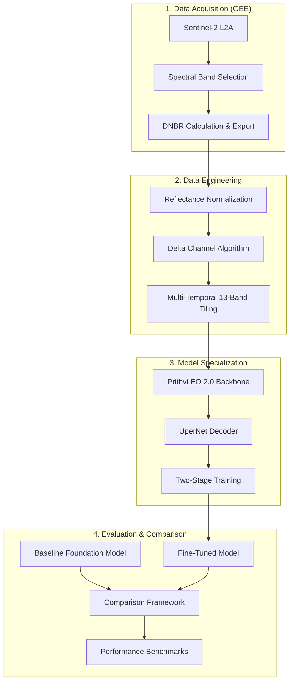
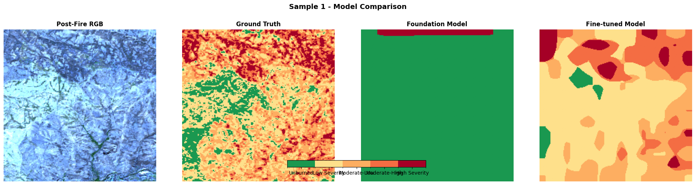

# GEE-Prithvi-BurnScar-End2End

**A comprehensive, end-to-end geospatial pipeline for wildfire damage assessment.**

This repository bridges the gap between raw orbital data and deep-learning-based classification. It provides a complete workflow from **Google Earth Engine (GEE)** data harvesting to **Prithvi EO 2.0** (Vision Transformer) fine-tuning and rigorous **Metric Comparison**.

## 🛠 Skills & Core Technologies

- **Earth Observation**: Google Earth Engine (GEE API), Sentinel-2 Multispectral Data.
- **Deep Learning**: PyTorch Lightning, Vision Transformers (ViT), UperNet Architecture.
- **Geospatial Engineering**: Delta-Channel Algorithm (Change Detection), Multi-Temporal Image Tiling.
- **Foundation Models**: NASA-IBM Prithvi EO 2.0 adaptation.
- **Evaluation**: Side-by-Side Model Benchmarking (+50.58% F1 improvement).

---

## Author & Contributions

The core of this repository, including data generation, model specialization, and comparative analysis, was developed by **Tushar Thokdar**.

### Tushar Thokdar's Algorithmic Contributions:

- **End-to-End Pipeline**: Developed the complete workflow from raw data export to model evaluation.
- **Delta Channel Algorithm**: Implemented a unique temporal stacking strategy that explicitly calculates the spectral difference between pre and post-fire states.
- **Advanced Fine-Tuning**: Configured a "Freeze-then-Unfreeze" training strategy, allowing the model to adapt its ViT backbone to burn scars without losing global spatial knowledge.
- **Evaluation Framework**: Built a comprehensive benchmarking suite that demonstrated a **+50.58%** improvement in Macro F1 score compared to the base foundation model.

---

## 🏗️ End-to-End Pipeline Architecture

The system follows a rigorous four-stage pipeline from raw orbital data to validated performance metrics.



### Technical Component Breakdown

1.  **GEE Export**: Pulls 6 spectral bands (B2, B3, B4, B8A, B11, B12).
2.  **Dataset Generator**: Creates 224x224 chips with a 3D temporal stack (Pre, Post, Delta).
3.  **Transformer Backbone**: Leverages pre-trained Vision Transformer weights for spatial-spectral understanding.
4.  **UperNet Decoder**: Processes multi-scale features for precise pixel-level segmentation.
5.  **Comparison Suite**: Validates the model against ground truth and provides a quantitative "Verdict" on improvement.

---

## Technical Specifications

### 1. Model Architecture

- **Backbone**: Prithvi EO 2.0 (Vision Transformer based Masked Autoencoder).
- **Decoder**: UperNet (Unified Perceptual Parsing Network) for high-resolution segmentation.
- **Input**: 3-frame temporal stack (Pre-fire, Post-fire, and the explicit Delta channel).

### 2. Algorithmic Highlights

- **The Delta Strategy**: `Delta = Clip(Post-fire - Pre-fire, -1.0, 1.0)`. This provides the model with direct information about the magnitude of spectral change.
- **Hybrid Loss**: Uses a combination of **Weighted Cross-Entropy** (to handle class imbalance) and **Dice Loss** (weight: 0.8) to optimize for precise burn scar geometries.
- **Training Pipeline**:
  - **Stage 1**: Backbone frozen for 5 epochs to train the UperNet decoder.
  - **Stage 2**: Full unfreezing for joint optimization.

---

## Repository Structure

- **`Fine-tuning a geospatial Foundation Model (Prithvi EO 2.0)/`**
  - `prithivi_finetune_with_delta.ipynb`: Main fine-tuning notebook utilizing 3D temporal stacking.
- **`Google Earth Engine to TIF Export/`**
  - `Google_Earth_Engine_to_TIF_Export.ipynb`: GEE scripts for harvesting Sentinel-2 spectral data.
- **`Prithvi data generation/`**
  - `Prithvi_data_generation.ipynb`: Author: Tushar Thokdar. Handles 13-band chip generation and quality control.
- **`Prithvi model comparison/`**
  - `Prithvi_model_comparison.ipynb`: Author: Tushar Thokdar. Detailed metric analysis including F1-scores and confusion matrices.

---

## 📊 Performance & Benchmarking

The specialized fine-tuning process yields a massive performance boost over the base foundation model, particularly in identifying high-severity fire damage.

| Metric          | Baseline Model | Fine-Tuned Model | Improvement |
| :-------------- | :------------- | :--------------- | :---------- |
| **Accuracy**    | 35.86%         | 69.93%           | **+34.07%** |
| **Macro F1**    | 0.1160         | 0.6218           | **+50.58%** |
| **Weighted F1** | 0.2035         | 0.7015           | **+49.80%** |
| **Burned F1**   | 0.0133         | 0.5553           | **+54.20%** |

### 1. Metric Comparison

The chart below illustrates the F1-score improvement across all severity classes. The fine-tuned model (green) consistently outperforms the foundation model (blue), which often fails to recognize specialized burn classes.


### 2. Confusion Matrices

Side-by-side analysis shows that while the foundation model is biased towards the "Unburned" class, the fine-tuned model accurately distributes predictions across the severity gradient.


### 3. Visual Validation

A direct comparison between the actual satellite imagery, ground truth labels, and model predictions. Notice how the fine-tuned model captures the intricate geometry of the burn scar that the foundation model misses.



---

## 🧠 Fine-Tuned Model Capabilities

Beyond simple classification, the model demonstrates high spatial coherence and spectral sensitivity to scorched earth patterns.

### Validation Prediction

The following capture shows the model's performance on unseen validation data, demonstrating its ability to generalize across different terrain types.


### Detailed Severity Confusion

Detailed breakdown of pixel-level classification accuracy for the specialized model.


---

## Technical Specifications

- **Model**: Prithvi EO 2.0 (IBM/NASA Geospatial ViT)
- **Libraries**: PyTorch, PyTorch Lightning, Terratorch, Rasterio, SMP.
- **Data**: Sentinel-2 (6 Bands: Red, Green, Blue, NIR, SWIR1, SWIR2).

## Getting Started

1.  **Environment Setup**:
    ```bash
    pip install -r requirements.txt
    ```
2.  **Data Export**: Use the GEE notebook to pull pre/post-fire imagery.
3.  **Dataset Preparation**: Run `Prithvi_data_generation.ipynb`.
4.  **Fine-Tuning**: Execute `prithivi_finetune_with_delta.ipynb`.
5.  **Comparison**: Use `Prithvi_model_comparison.ipynb` to verify results.
